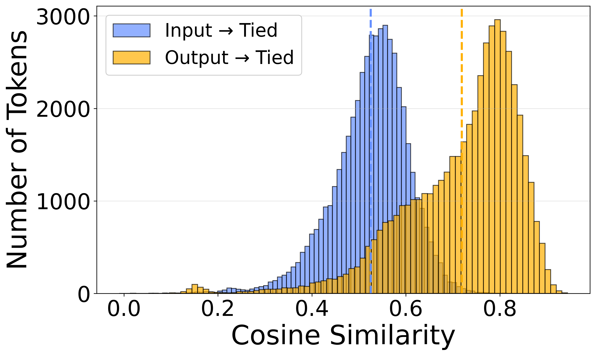
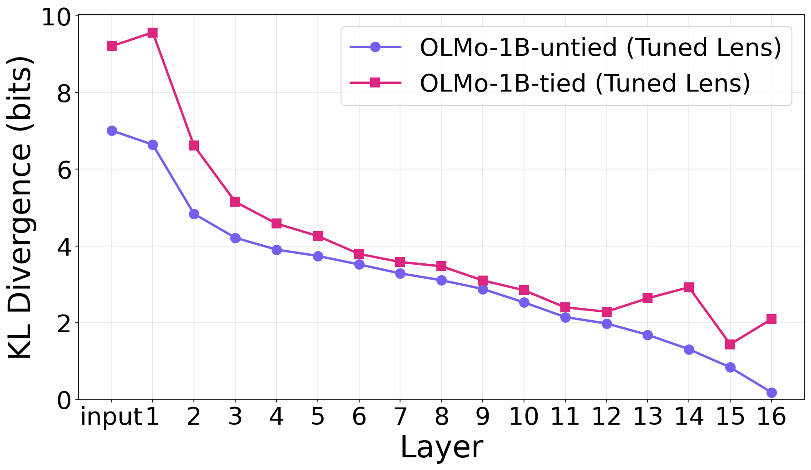
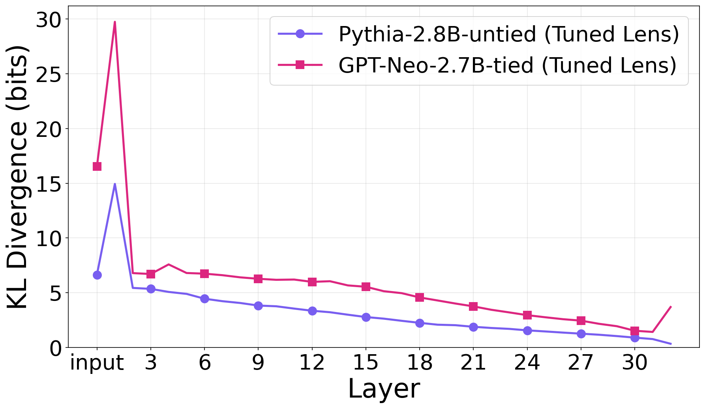
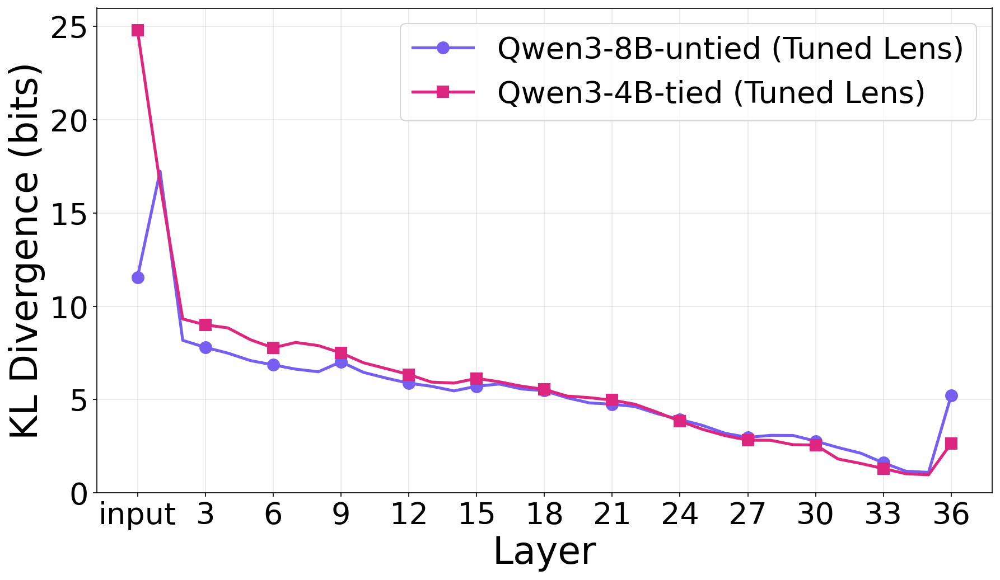
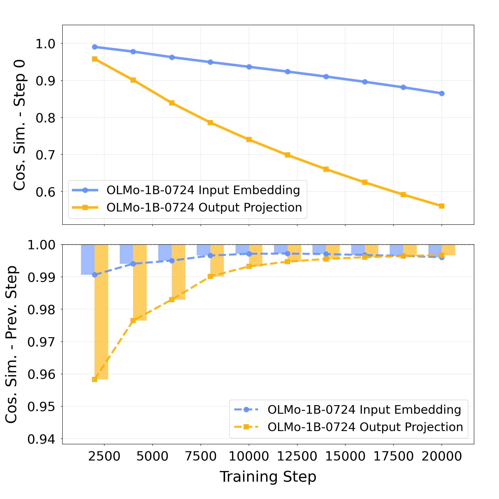
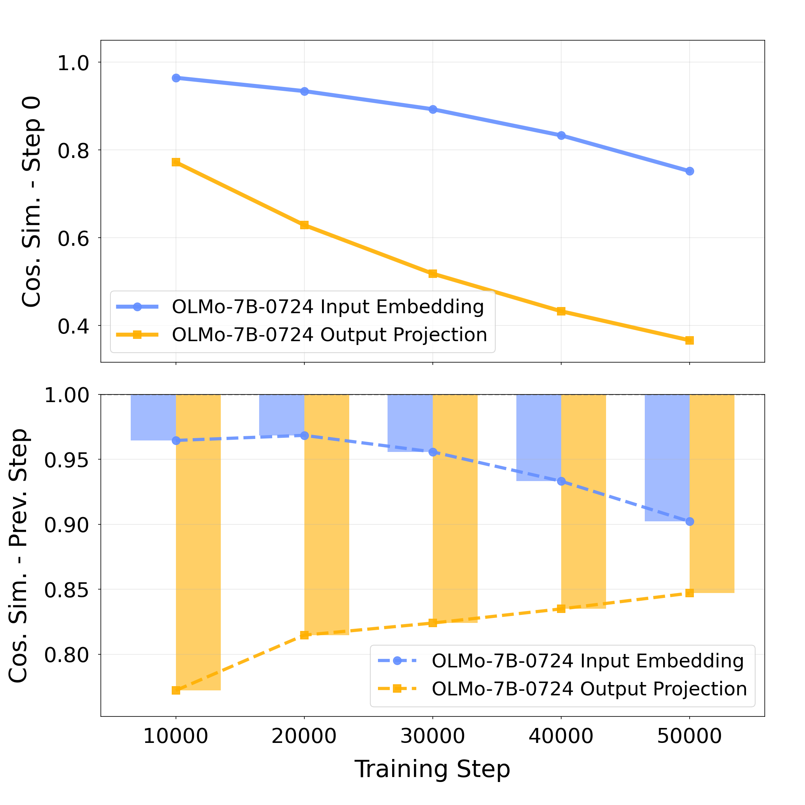
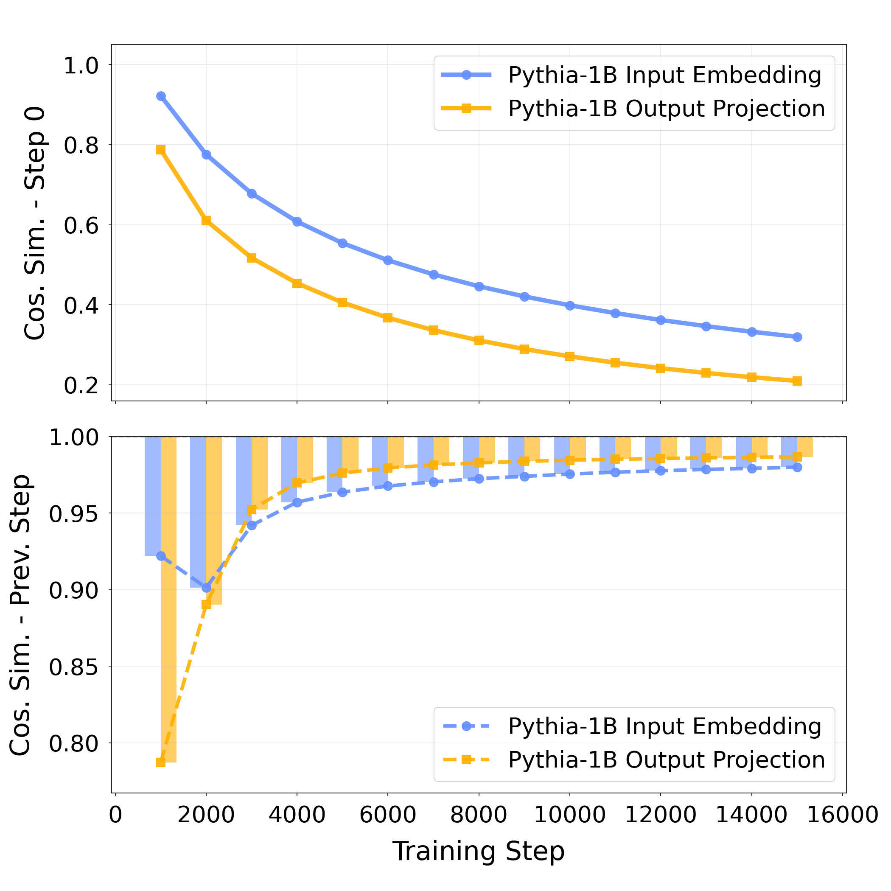
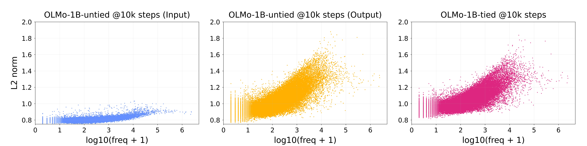
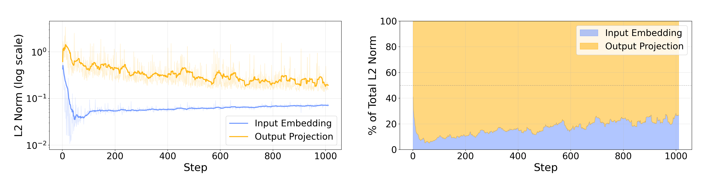

# Weight Tying Biases Token Embeddings Towards the Unembedding Space

Reproduction repository for the ACL submission analyzing how weight tying affects the relationship between input (embedding) and output (unembedding) matrices in language models.

Please open an issue if you encounter problems.

## Abstract

Weight tying—sharing parameters between input and output embedding matrices—is common in LM design, yet its impact on the learned embedding space remains poorly understood. We show that:

1. **Tied embeddings align with output, not input** (Table 1, Figure 1)
2. **Early layers suffer** — elevated KL divergence in tuned lens (Figure 2)
3. **Output gradients dominate** — 80-90% of learning signal early in training (Figure 4)
4. **Gradient scaling confirms causality** — amplifying input gradients shifts structure (Table 2)

## Paper → Code Mapping

| Section | Experiment | Outputs | Status |
|---------|-----------|---------|--------|
| 4.1 | Embedding Alignment | Table 1, Figure 1 | Scripts exist, needs testing |
| 4.2 | Tuned Lens Analysis | Figure 2 | Scripts + pre-trained lenses |
| 5.1 | Embedding Evolution | Figure 3 | Script exists, needs testing |
| 5.2 | Norm-Frequency | Figure 5 | Scripts exist, needs testing |
| 5.3 | Gradient Flow | Figure 4 | Plotting script + pre-generated figures |
| 6 | Gradient Scaling | Table 2 | Checkpoints available |
| App. B | KNN Overlap | Table 5 | Script exists |
| App. C | Tuned Lens (extended) | Figures 6, 7 | Scripts + pre-generated figures |
| App. D | Evolution (extended) | Figures 8, 9 | Script exists |
| App. E | Scaling (extended) | Table 6 | Checkpoints available |

## Repository Structure

```
weight-tying-bias/
├── experiments/
│   ├── 1_embedding_alignment/    # Section 4.1: Table 1, Figure 1, Table 5
│   ├── 2_tuned_lens/             # Section 4.2: Figures 2, 6, 7
│   ├── 3_embedding_evolution/    # Section 5.1: Figures 3, 8, 9
│   ├── 4_norm_frequency/         # Section 5.2: Figure 5
│   ├── 5_gradient_flow/          # Section 5.3: Figure 4
│   └── 6_gradient_scaling/       # Section 6: Tables 2, 6
│
├── OLMo/                         # Modified fork of allenai/OLMo (v0.6.0)
├── tuned-lens/                   # Unmodified copy of AlignmentResearch/tuned-lens (v0.2.0)
├── utils/                        # Shared utilities
├── results/
│   ├── tables/
│   └── figures/
│
├── README.md
└── requirements.txt
```

### Bundled Dependencies

- **OLMo** — modified fork of [allenai/OLMo](https://github.com/allenai/OLMo) (v0.6.0) with gradient tracking and scaling hooks for experiments 5 and 6. See [OLMo/PROVENANCE.md](OLMo/PROVENANCE.md) for details.
- **tuned-lens** — unmodified copy of [AlignmentResearch/tuned-lens](https://github.com/AlignmentResearch/tuned-lens) (v0.2.0, MIT license) for experiment 2.

## Environment Setup

```bash
cd weight-tying-bias
python3 -m venv .venv
source .venv/bin/activate
pip install -r requirements.txt
pip install -e .
pip install -e './tuned-lens'
pip install -e './OLMo[all]'
```

Verify everything is working:

```bash
python -c "import torch; print('PyTorch', torch.__version__, '| CUDA', torch.cuda.is_available())"
python -c "import transformers; print('Transformers', transformers.__version__)"
python -c "import tuned_lens; print('tuned-lens OK')"
```

## Quick Start

### Experiment 1: Embedding Alignment (Table 1, Figure 1)

```bash
cd experiments/1_embedding_alignment

# OLMo comparison (Figure 1)
python compare_cross_model.py

# GPT-Neo/Pythia comparison
python compare_pythia_gptneo.py

# KNN overlap (Table 5)
python Appendix_B/reproduce_table5.py
```



---

### Experiment 2: Tuned Lens (Figures 2, 6, 7)

```bash
cd experiments/2_tuned_lens

# OLMo tied vs untied (Figure 2)
python compare_olmo_tuned_lenses.py

# Pythia vs GPT-Neo (Figure 6)
python Appendix_C/reproduce_figure6.py

# Qwen3 (Figure 7)
python Appendix_C/reproduce_figure7.py
```





---

### Experiment 3: Embedding Evolution (Figures 3, 8, 9)

```bash
cd experiments/3_embedding_evolution

# OLMo-1B-0724 (Figure 3)
python track_evolution.py --config configs/evolution_olmo_1b.json

# OLMo-7B (Figure 8, Appendix D)
python track_evolution.py --config configs/evolution_olmo_7b.json

# Pythia-1B (Figure 9)
python track_evolution.py --config configs/evolution_pythia_1b.json
```





---

### Experiment 4: Norm-Frequency (Figure 5)

```bash
cd experiments/4_norm_frequency
python main.py plot-figure5 --config configs/tok_config_figure5_local.json
```



## Models

See **[MODELS.md](MODELS.md)** for a comprehensive list of all models, their HuggingFace IDs, checkpoint formats, and paper references.

| Model | HuggingFace ID | Weight Tying | Paper Role |
|-------|---------------|--------------|------------|
| OLMo-1B | `allenai/OLMo-1B-hf` | **Tied** | Main comparison |
| OLMo-1B-0724 | `allenai/OLMo-1B-0724-hf` | Untied | Main comparison |
| GPT-Neo-2.7B | `EleutherAI/gpt-neo-2.7B` | **Tied** | Cross-family validation |
| Pythia-2.8B | `EleutherAI/pythia-2.8b` | Untied | Cross-family validation |
| Qwen3-4B | `Qwen/Qwen3-4B` | **Tied** | Scale-dependent validation |
| Qwen3-8B | `Qwen/Qwen3-8B` | Untied | Scale-dependent validation |

### Loading Models with Specific Checkpoints

```python
from transformers import AutoModelForCausalLM

# OLMo at step 10000 (for Figure 3)
model = AutoModelForCausalLM.from_pretrained(
    "allenai/OLMo-1B-0724-hf",
    revision="step10000-tokens20B"
)

# Pythia at step 1000 (for Figure 9)
model = AutoModelForCausalLM.from_pretrained(
    "EleutherAI/pythia-1b",
    revision="step1000"
)
```

## Key Results

### Table 1: Embedding Alignment (Linear transformation)

| Comparison | OLMo | GPT-Neo/Pythia |
|------------|------|----------------|
| Output(U) → Tied | **0.719** | **0.637** |
| Input(U) → Tied | 0.525 | 0.507 |

### Figure 4: Gradient Flow (First 1000 steps)

- Output gradients: 80-90% of total signal
- Input gradients: 10-20% of total signal



### Table 2: Gradient Scaling Effect (Step 10K)

| Model | vs Untied Input | vs Untied Output |
|-------|-----------------|------------------|
| Baseline | 0.216 | 0.384 |
| Input ×5 | 0.222 (+0.006) | 0.369 (-0.015) |

## Artifacts

Model checkpoints and trained lenses are hosted on [HuggingFace](https://huggingface.co/datasets/AntonioLopardo/weight-tying-bias-artifacts).

```bash
# Download all artifacts (~44GB)
./download_artifacts.sh

# Or download only what you need
./download_artifacts.sh 4        # Experiment 4 checkpoints (Figure 5)
./download_artifacts.sh 2 6      # Tuned lenses + gradient scaling checkpoints
```

Available experiments: `2` (tuned lenses), `4` (norm-frequency), `5` (gradient flow), `6` (gradient scaling).
