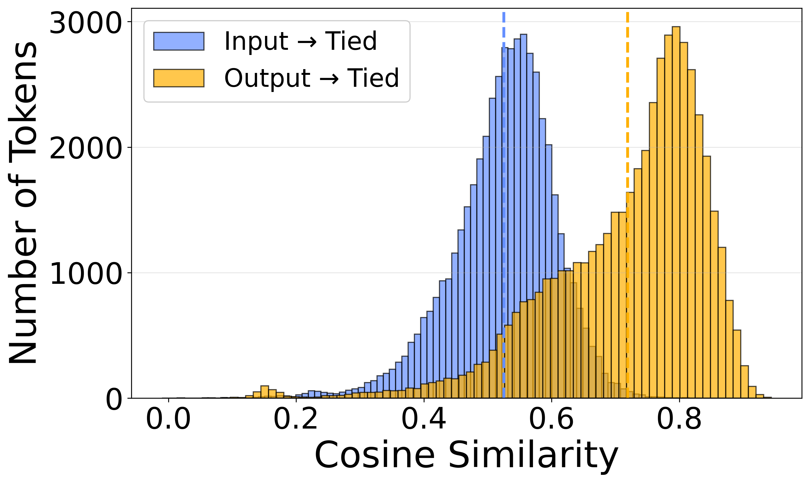
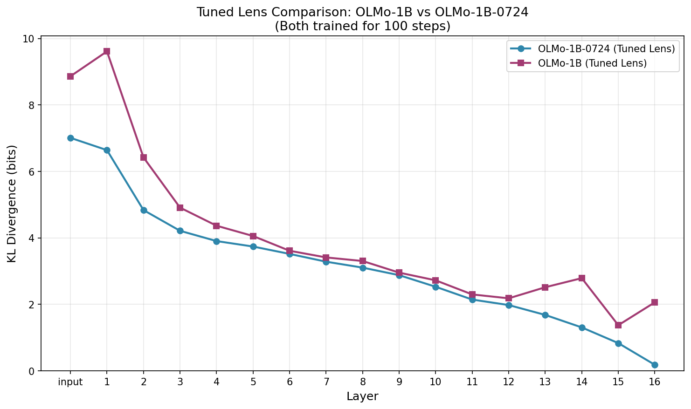
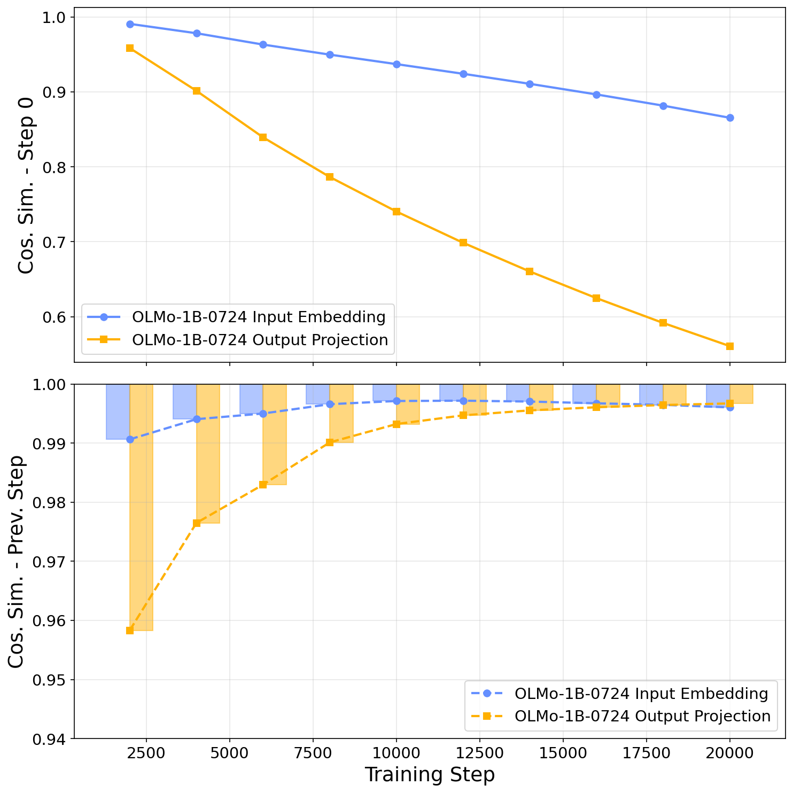
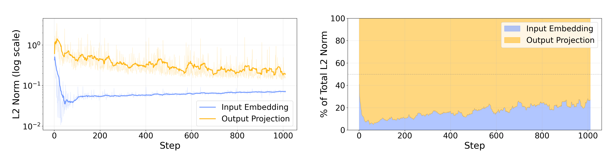
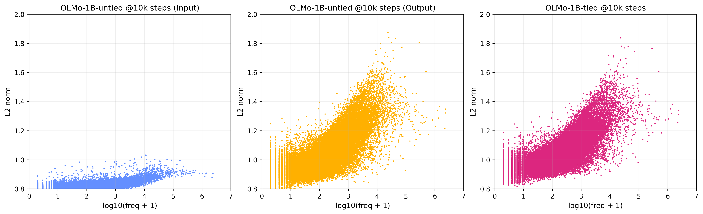
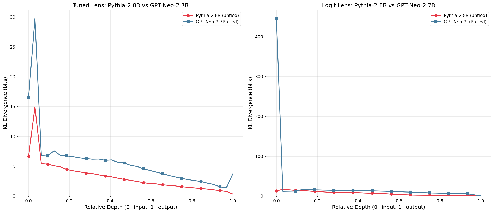
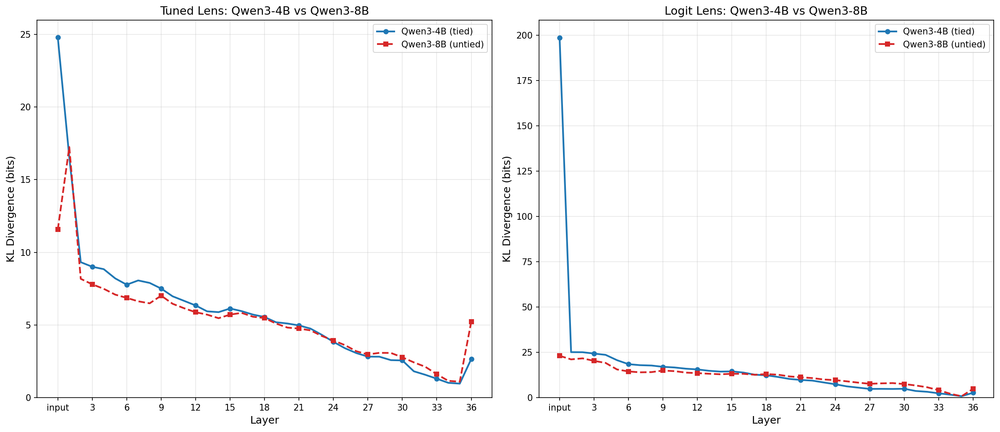
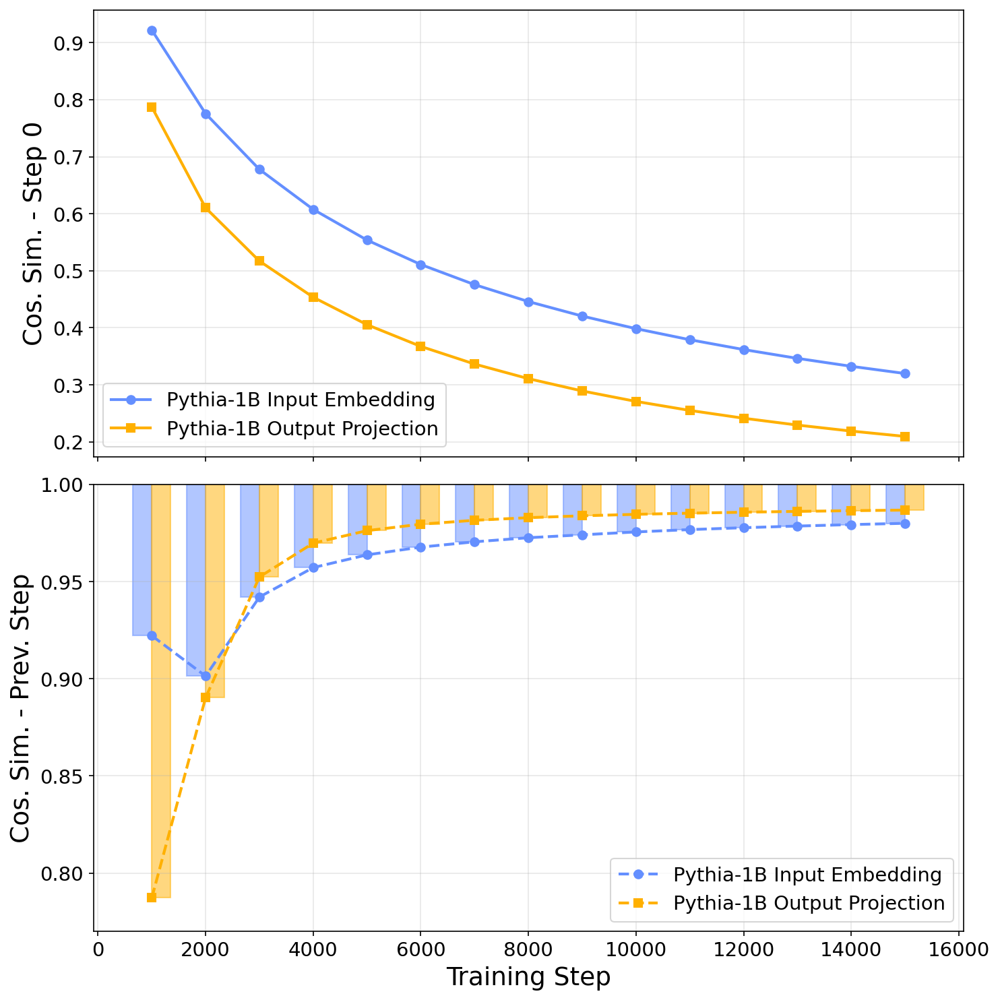
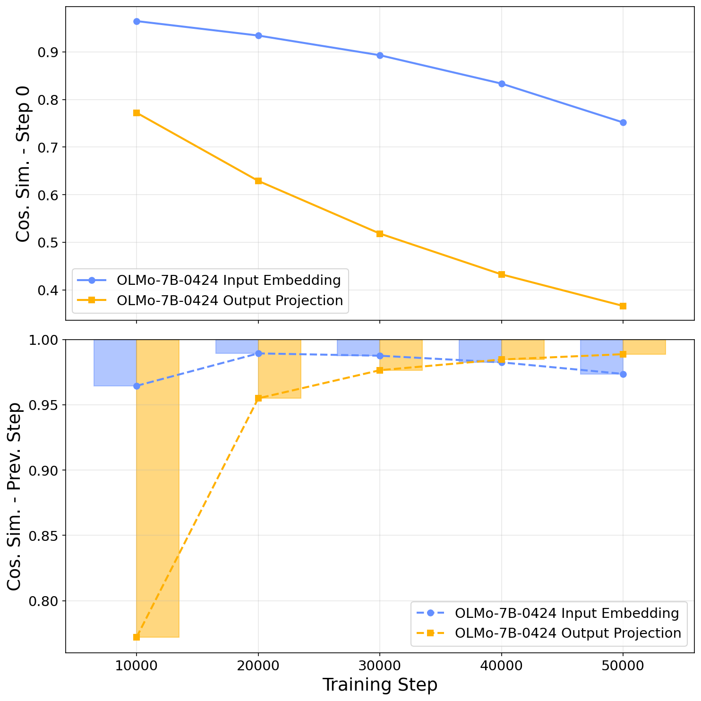

# Reproduced Results

## Figure 1: Token-Level Alignment (Experiment 1)

| Alignment | Mean Cosine Similarity |
|-----------|----------------------|
| Input → Tied | 0.525 |
| Output → Tied | 0.719 |
| Difference | 0.194 |

## Figure 2: Tuned Lens KL Divergence (Experiment 2)

| Layer | OLMo-1B-0724 (untied) | OLMo-1B (tied) |
|-------|----------------------|----------------|
| input | 7.0100 | 8.8627 |
| 1 | 6.6405 | 9.6107 |
| 2 | 4.8366 | 6.4213 |
| 3 | 4.2136 | 4.9111 |
| 4 | 3.9043 | 4.3663 |
| 5 | 3.7399 | 4.0567 |
| 6 | 3.5179 | 3.6127 |
| 7 | 3.2839 | 3.4119 |
| 8 | 3.1053 | 3.3043 |
| 9 | 2.8785 | 2.9546 |
| 10 | 2.5290 | 2.7228 |
| 11 | 2.1443 | 2.2989 |
| 12 | 1.9792 | 2.1818 |
| 13 | 1.6820 | 2.5153 |
| 14 | 1.3064 | 2.7890 |
| 15 | 0.8342 | 1.3733 |
| 16 | 0.1820 | 2.0609 |

## Figure 3: Embedding Evolution — OLMo-1B-0724 (Experiment 3)

## Figure 4: Gradient Flow (Experiment 5)

| Metric | Value |
|--------|-------|
| Output % of total (mean) | 83.2% |
| Input % of total (mean) | 16.8% |
| Output/Input ratio (mean) | 6.16x |
| Output/Input ratio (median) | 4.29x |

## Figure 5: Norm-Frequency (Experiment 4)

## Table 1: Embedding Alignment (Experiment 1)

See `experiments/1_embedding_alignment/` scripts for full Table 1 reproduction.

## Table 2: Gradient Scaling — Step 10K (Experiment 6)

| Model | vs Untied Input | vs Untied Output |
|-------|-----------------|------------------|
| Tied (no scaling) | 0.216 | 0.384 |
| Tied (input x5) | 0.222 | 0.369 |

---

## Appendix

### Table 5: KNN@10 Overlap (Appendix B)

| Comparison | KNN@10 |
|------------|--------|
| **OLMo-1B (tied) vs OLMo-1B-0724 (untied)** | |
| Tied vs Untied Input | 0.496 |
| Tied vs Untied Output | **0.733** |
| Untied Input vs Untied Output | 0.455 |
| **Qwen3-4B (tied) vs Qwen3-8B (untied)** | |
| Tied vs Untied Input | 0.366 |
| Tied vs Untied Output | **0.712** |
| Untied Input vs Untied Output | 0.366 |
| **GPT-Neo-2.7B (tied) vs Pythia-2.8B (untied)** | |
| Tied vs Untied Input | 0.372 |
| Tied vs Untied Output | 0.408 |
| Untied Input vs Untied Output | **0.611** |

### Figure 6: Tuned Lens — Pythia vs GPT-Neo (Appendix C)

### Figure 7: Tuned Lens — Qwen3 (Appendix C)

### Figure 9: Embedding Evolution — Pythia-1B (Appendix D)

### Figure 8: Embedding Evolution — OLMo-7B (Appendix D)

### Table 6: Gradient Scaling — Step 1K (Appendix E)

| Model | vs Untied Input | vs Untied Output |
|-------|-----------------|------------------|
| Tied (no scaling) | 0.172 | 0.197 |
| Tied (input x2) | 0.172 | 0.197 |
| Tied (input x10) | 0.173 | 0.190 |
